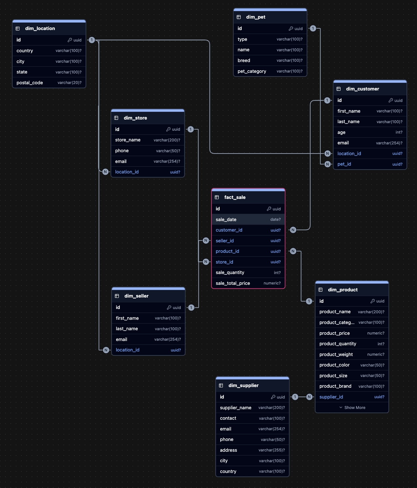

# BigDataSnowflake
Анализ больших данных - лабораторная работа №1 - нормализация данных в снежинку

> **Задание:** Необходимо данные источника (файлы mock_data.csv с номерами), которые представляют информацию о покупателях, продавцах, поставщиках, магазинах, товарах для домашних питомцев трансформировать в модель снежинка/звезда (факты и измерения с нормализацией).
>
> Результат работы:
> 1. Репозиторий с исходными данными mock_data(*).csv — 10 файлов по 1000 строк.
> 2. Файл `docker-compose.yml` с PostgreSQL и автозаполнением данных.
> 3. Скрипты DDL — создание таблиц фактов и измерений.
> 4. Скрипты DML — заполнение таблиц из исходных данных.

---

В данной лабораторной работе реализована аналитическая модель данных **Snowflake Schema** на основе исходных данных о продажах зоомагазина.

## Модель данных



Схема состоит из таблицы фактов и 7 таблиц измерений:

- **fact_sale** — факт продажи: дата, количество, сумма, ссылки на измерения
- **dim_customer** — покупатель: имя, возраст, email, питомец, локация
- **dim_seller** — продавец: имя, email, локация
- **dim_product** — товар: название, бренд, цена, вес, категория, поставщик
- **dim_supplier** — поставщик: название, контакт, локация
- **dim_store** — магазин: название, локация
- **dim_location** — локация: страна, город, штат, почтовый индекс
- **dim_pet** — питомец: тип, порода, категория

`dim_location` вынесена отдельно и используется несколькими измерениями (customer, seller, supplier, store) — это и делает схему "снежинкой", а не "звездой".

## Структура проекта

```text
├── docker-compose.yml
├── migrations/
│   ├── 001_create_staging.sql   # staging таблица mock_data
│   ├── 002_load_data.sql        # COPY из CSV в mock_data
│   ├── 003_ddl_dimensions.sql   # DDL таблиц измерений
│   ├── 004_ddl_facts.sql        # DDL таблицы фактов
│   ├── 005_dml_dimensions.sql   # DML измерений
│   └── 006_dml_facts.sql        # DML фактов
├── data/
│   └── MOCK_DATA(1-10).csv
└── README.md
```

## Запуск

```bash
git clone https://github.com/NikitaKoros/highload_lab1_snowflake.git
cd highload_lab1_snowflake
docker compose up
```

Доступ к бд после запуска:

| Параметр | Значение |
|----------|----------|
| Host | localhost |
| Port | 5433 |
| Database | snowflake |
| User | postgres |
| Password | postgres |

## Проверка результата

Проверено с помощью запросов: 

```sql
SELECT COUNT(*) FROM mock_data;    -- 10000
SELECT COUNT(*) FROM fact_sale;    -- 10000
SELECT COUNT(*) FROM dim_customer; -- 10000
```


